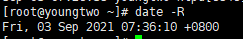
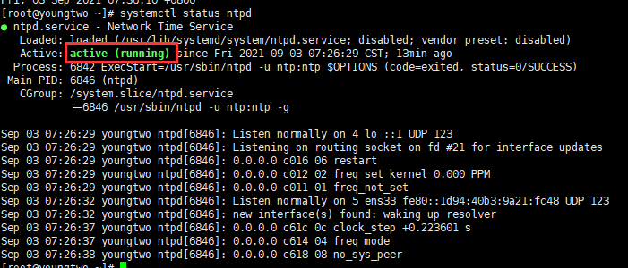

# 1 设置时区/时间同步

1 查看系统支持的时区列表

```shell
timedatectl list-timezones
#正常centos7系统一般都有shanghai
```

2 查看时间是否正确

```shell
date -R
#+0800就代表正确了，为shanghai时区
```



3 设置时区

```shell
timedatectl set-timezone Asia/Shanghai
#将时区改为shanghai
```

4 安装ntp(*ntp*时间服务器,可以持续校准时间)

```shell
sudo yum -y install ntp
```

5 开启ntp

```shell
systemctl start ntpd
```

6 查看ntp状态，是否启动成功

```shell
systemctl status ntpd
```



7 以任意方式将ntp加入开机自启

引用：https://www.cnblogs.com/xsbx/p/10172728.html

