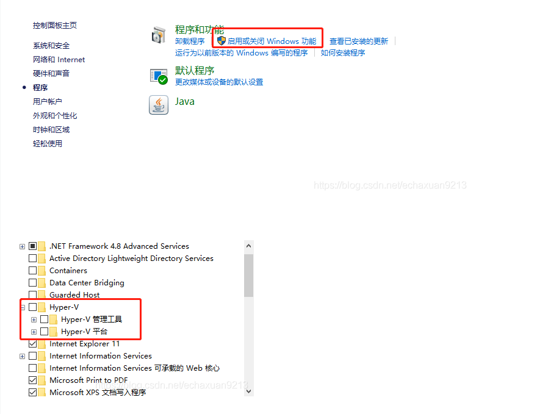
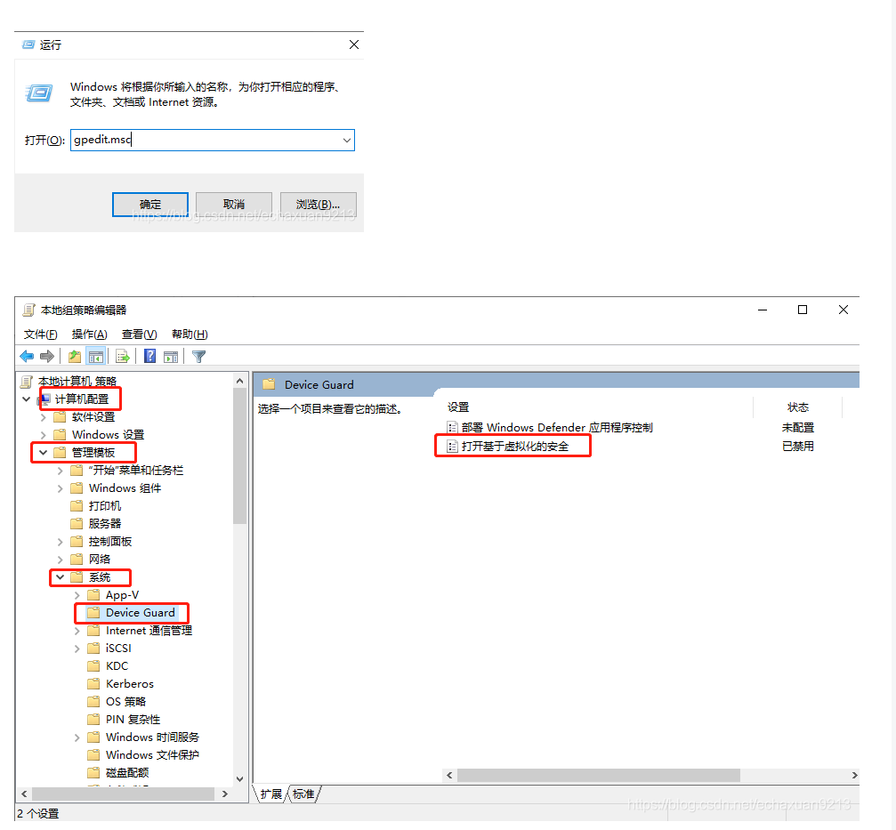
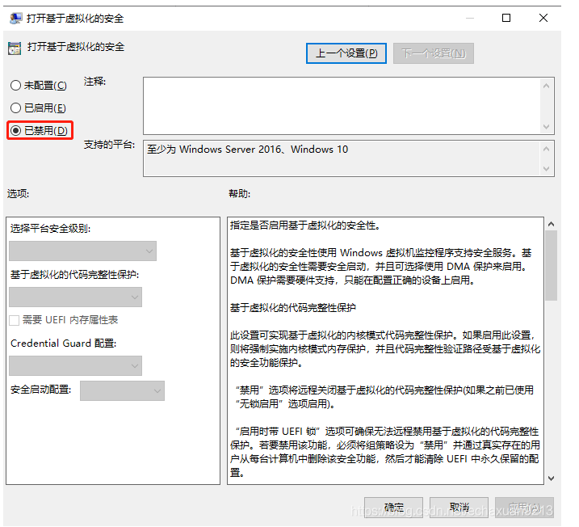
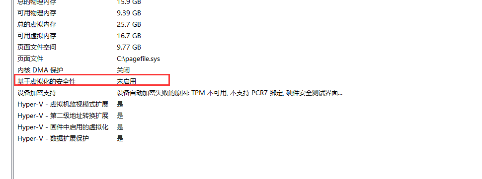

# 1、关闭Hyper-V

打开控制面板首页，找到“程序”，然后找到“启用或关闭Windows功能”，找到“Hyper-V”，有勾中的全部都取消掉，如果这一步操作**失败**，不要紧，继续往下进行，最后回过来在**重复**进行一遍

# 2、关掉 Device/Credenti

“win+ R“打开运行，输入gpedit.msc

本地计算机策略 --> 计算机配置 --> 管理模板>系统 --> Device Guard

基于虚拟化的安全设置为“已禁用”

win+X

打开Windows PowerShell（管理员）

输入：bcdedit /set hypervisorlaunchtype off

确认即可

修改完成后重启虚拟机即可

# 3 查看

在搜索框输入msinfo32.exe

引用：

https://blog.csdn.net/sangyi1122/article/details/105951693/