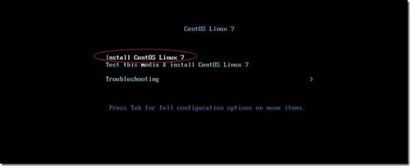

### 1 安装vm

版本为15.5

略，傻瓜式安装，激活码网上搜索直接使用。

https://www.jianshu.com/p/552179808ebf

### 2 新建虚拟机

稍后按照操作系统，设置基本内存处理器，等基本配置。

### 3 安装centos7操作系统

​	使用镜像文件

开启虚拟机

回车下一步，出现图形界面

​	设置system部分相关必选项，磁盘，密码等(黄色/红色等提示选项)

​	设置磁盘相关

​	最后reboot完成

### 4 网络配置相关

​	根据本机ip设置子网地址，一般子网ip最后为默认0，网关为2

对应网络适配器使用net8(NAT)模式

	

**PS:对应ens33/eth0中的ip、网关只需要和vm的对应就行。网关一模一样，ip在同一个网段即可。不需要和物理机的ip在一个网段**

在/etc/sysconfig/network-scripts 目录中修改ens33/eth0配置

​	配置完成后 service network restart 重启网络

​	ping www.baidu.com 测试是否成功。

引用文章

https://www.cnblogs.com/wcwen1990/p/7630545.html

https://www.cnblogs.com/passer101/p/9899202.html

