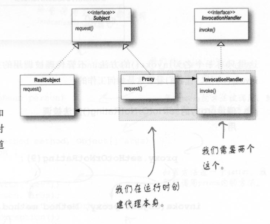
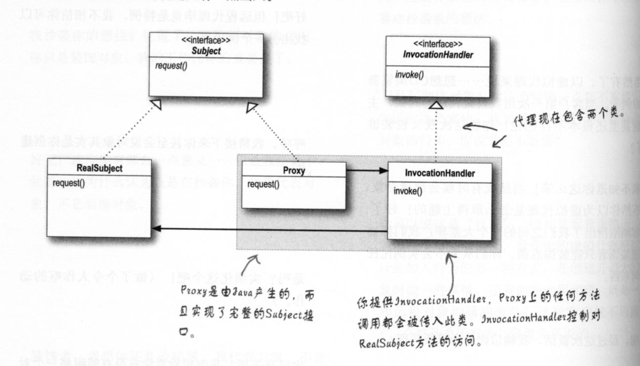

**定义：**代理模式为另一个对象提供一个替身或占位符以控制对这个对象的访问。

**类图**

**远程代理：**

​	远程代理可以作为另一个JVM对象的本地代表。调用代理的方法，会被代理利用网络转发到远程执行，并且结果会通过网络返回给代理，再由代理将结果转给客户。

**虚拟代理：**

​	虚拟代理作为创建开销大的对象的代表。虚拟代理经常直到我们真正需要一个对象的时候才创建它。当对象在创建前和创建中时，由虚拟代理来扮演对象的替身。对象创建后，代理就会将请求直接委托给对象(可以异步创建对象，然后监测状态，当异步创建已完成，再由代理取得真正的对象)

**JDK动态代理：**

​	可以在运行时动态创建一个代理类，实现一个或多个接口，并将方法调用转发到所指定的类。因为实际的代理类是在运行时动态创建的，所以称为动态代理。

类图：

**保护代理：**

​	根据访问权限决定是否可以访问方法，避免方法被随意调用(可以通过JDK动态代理来实现)。

