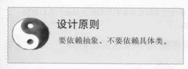
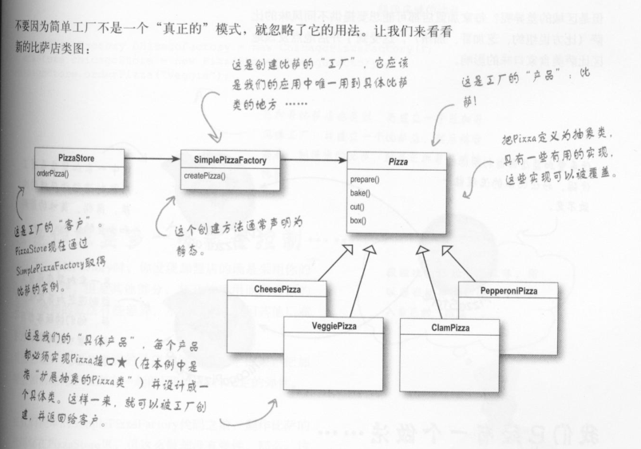
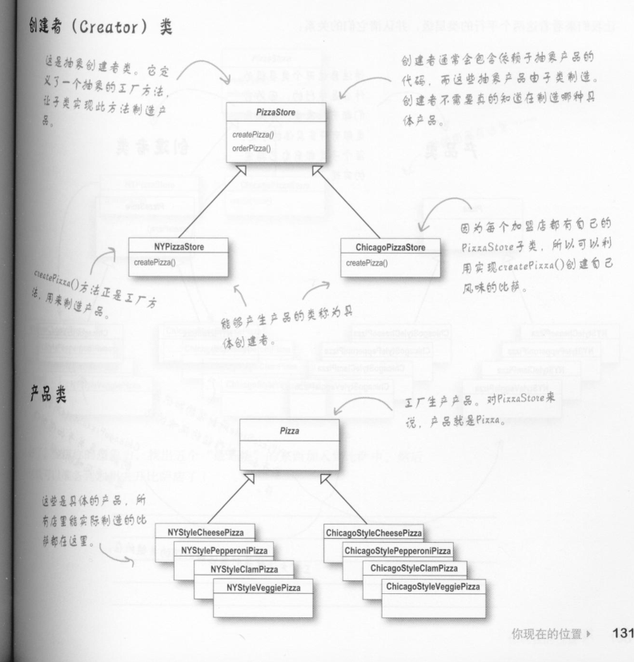
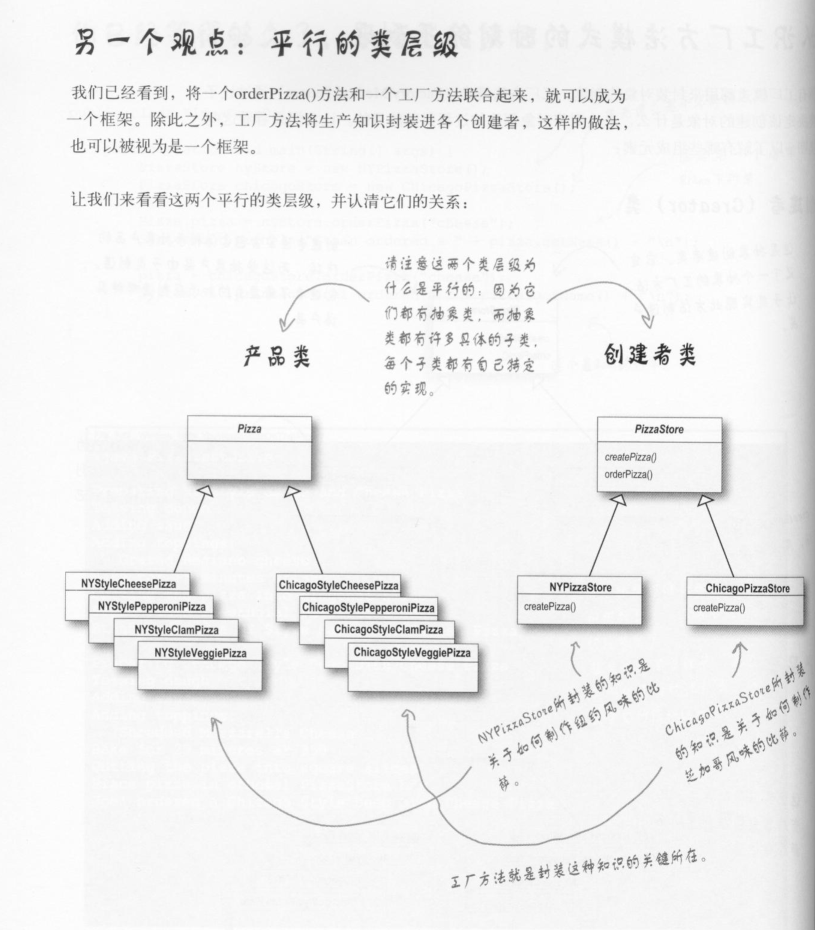
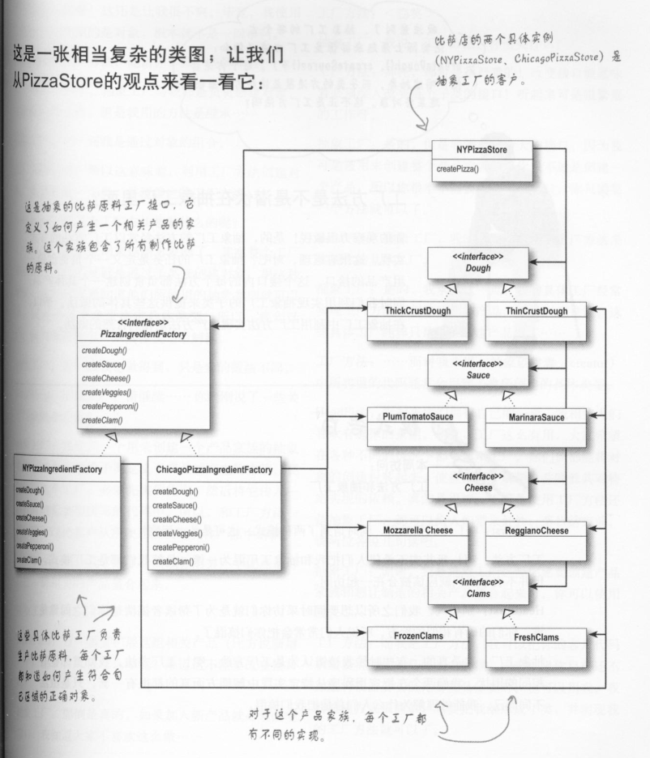
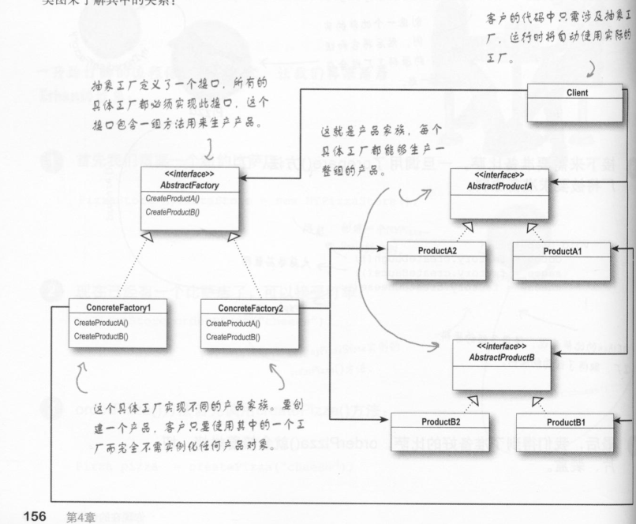
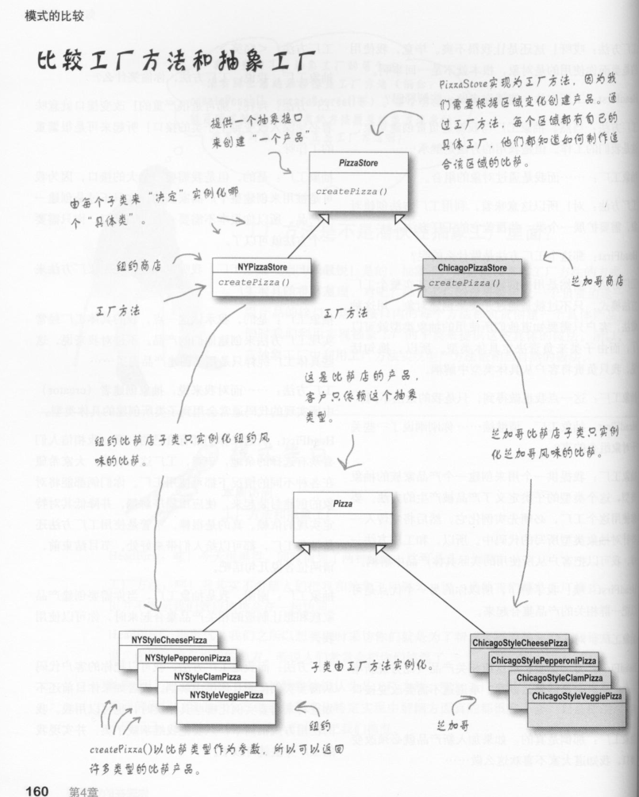

**定义工厂模式：** 工厂模式定义了一个创建对象的接口，但由于子类决定要实例化的类是哪一个。工厂方法让类把实例化推迟到子类。

**依赖导致原则：**依赖于抽象，不要依赖具体类(Dependency Inversion Principle)

**定义抽象工厂模式：**抽象工厂模式提供一个接口，用于创建相关或依赖对象的家族，而不需要明确指定具体类。

**简单工厂：**

**工厂模式：**

**抽象工厂：**

​		案例部分类图：

​		定义抽象工厂模式类图：

**工厂模式、抽象工厂模式对比：**

