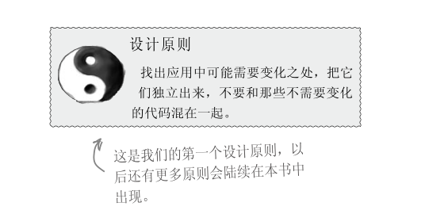
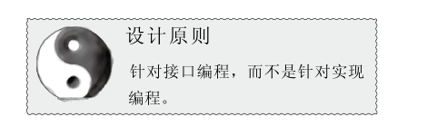
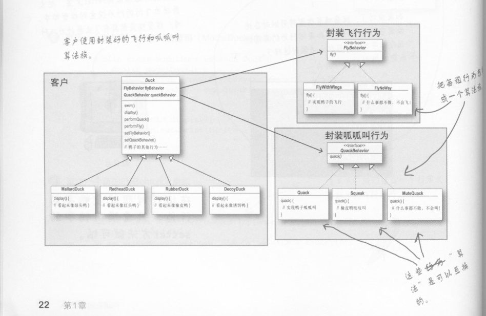
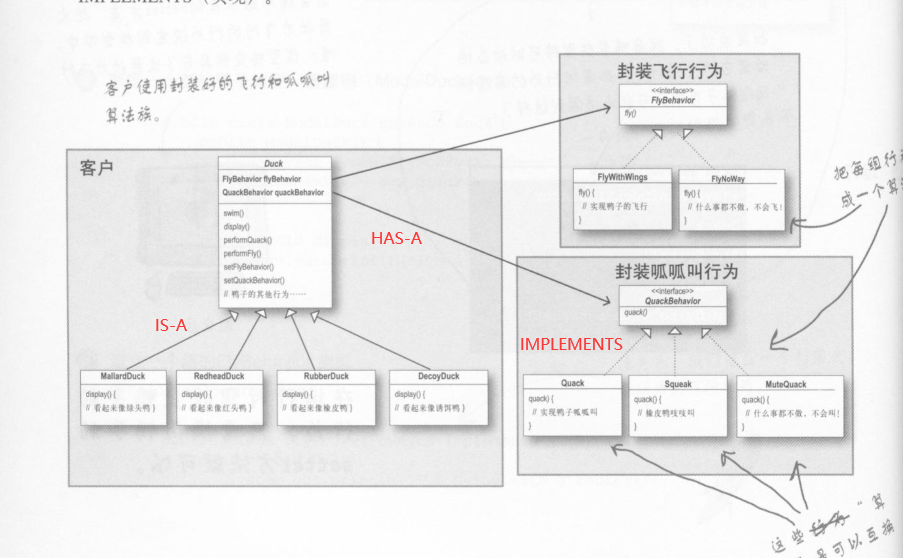
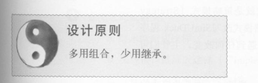
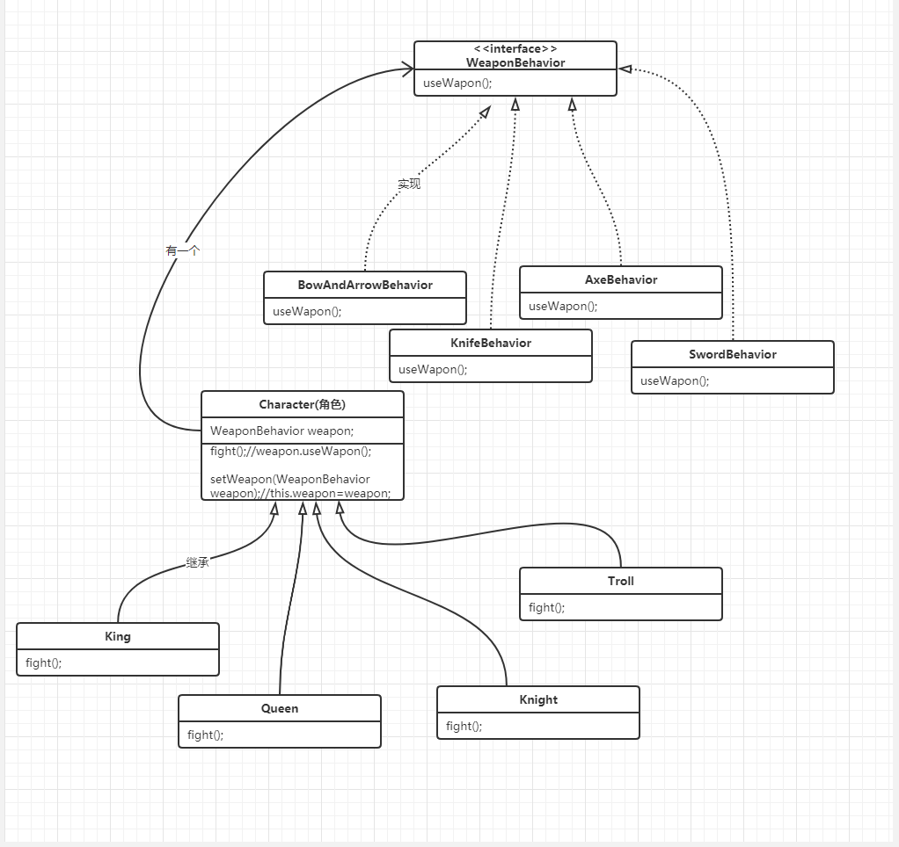

​	对于示例鸭子的一组行为(飞行/叫声)，可以称为一族算法。下图对应的箭头关系可以是IS-A(是一个)，HAS-A(有一个)或IMPLEMENTS(实现)






​	用''有一个''的方式去组合，少用"是一个的方式"继承。将多个行为(算法族)结合起来就是组合



​	使用组合建立系统具有很大的弹性，不仅可以将算法族封装成类，更可以"在运行时动态的改变行为"，只要组合的行为对象符合即可


​	**定义：**定义了算法族，分别封装起来，让它们之间可以互相替换，此模式让算法变化独立于使用算法的客户。

​	

​	我的测试题




```java
Character cha = new Knight();
cha.setWeapon(new SwordBehavior());
cha.fight();
```


