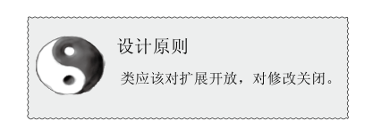
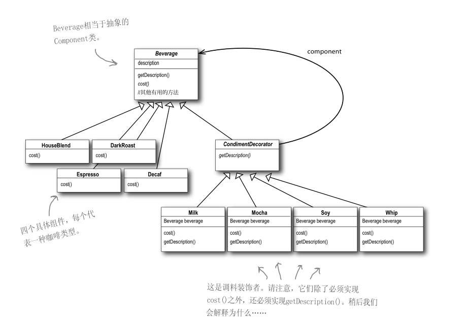
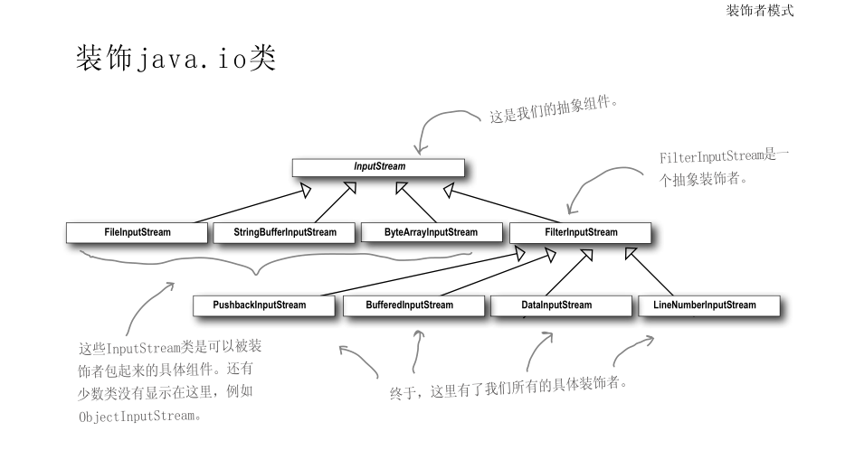
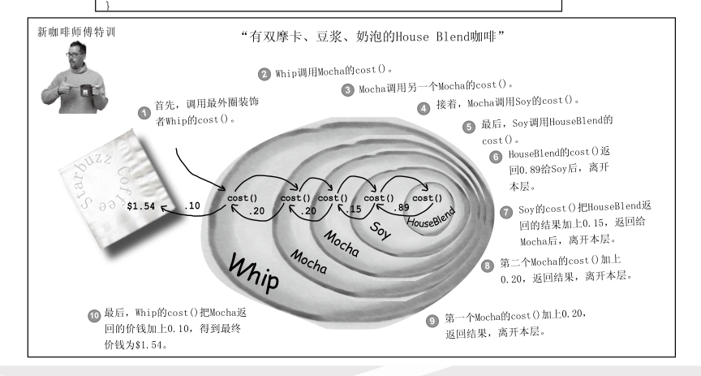

**定义：**装饰者模式动态的将责任附加在对象上。若要扩展功能，装饰者提供了比继承更有弹性的替代方案。







```java
Beverage beverageTwo = new Mocha(new Soy(new Whip(new Espresso())));
System.out.println("description:"+beverageTwo.getDescription()+",$"+beverageTwo.cost());
//或者
Beverage beverageTwo = new Espresso();
        beverageTwo = new Mocha(beverageTwo);
        beverageTwo = new Soy(beverageTwo);
        beverageTwo = new Whip(beverageTwo);
System.out.println("description:"+beverageTwo.getDescription()+",$"+beverageTwo.cost());
```