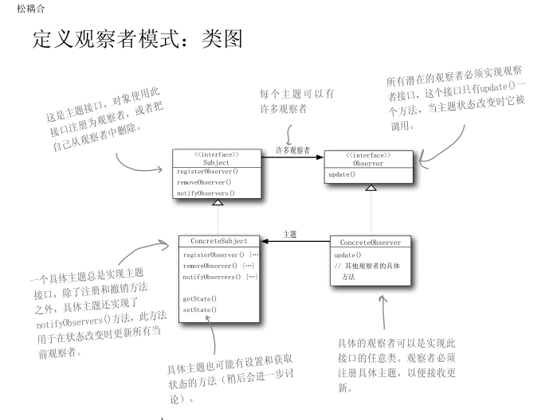
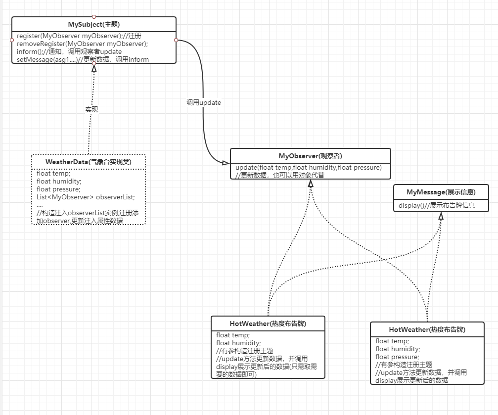
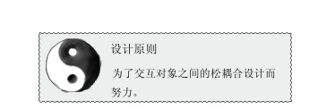

出版者+订阅者=观察者模式

主题(subject)-观察者(Observer)

​	**定义：**观察者模式定义了对象之间的一对多依赖，这样一来，当一个对象改变状态时，它的所有依赖者都会收到通知并自动更新。

我的测试类：

PS:也可以直接使用java.util.Observable 来实现观察者模式，不过最新版本jdk已经弃用，可以用java.util.concurrent.Flow(出版/订阅模式)来代替

